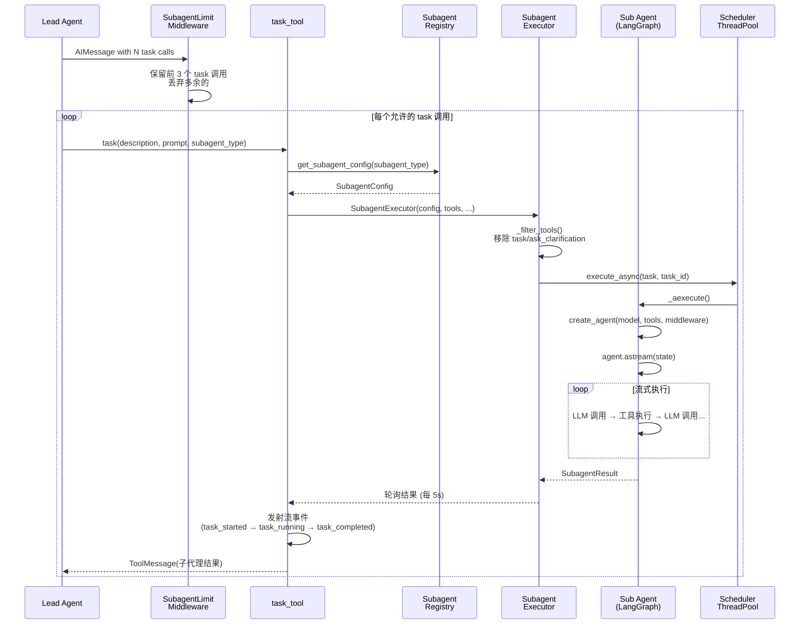
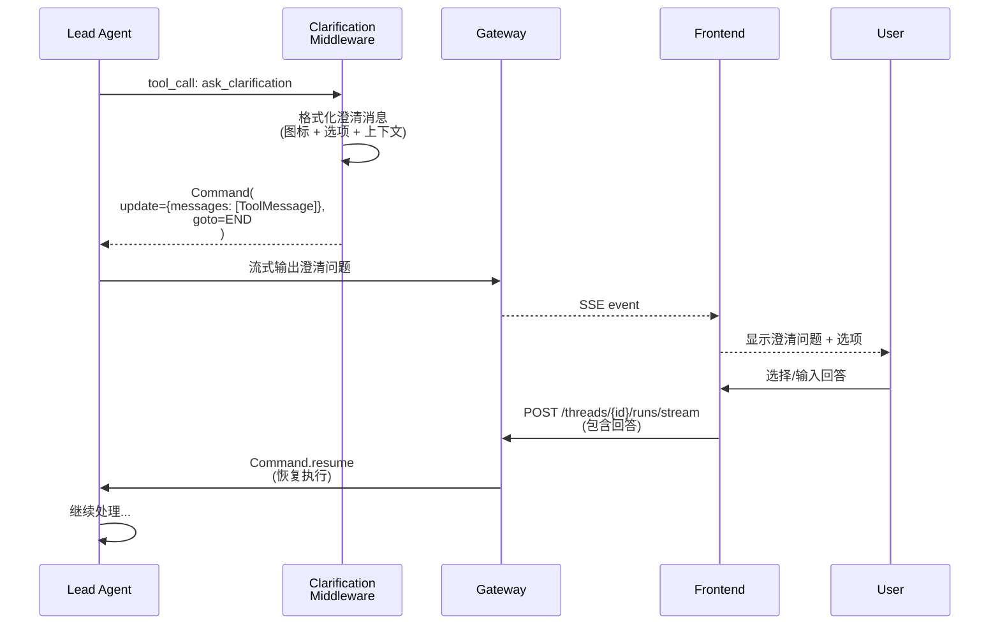

# DeerFlow Agent 执行时序图

本文档描述从用户发起请求到 Agent 返回结果的完整数据交互流程。

---

## 1. 整体架构概览

```
┌──────────┐     ┌──────────┐     ┌──────────────────┐     ┌──────────────────┐
│ Frontend │────▶│  Nginx   │────▶│ FastAPI Gateway  │────▶│  LangGraph Agent │
│ (Next.js)│◀────│ (2026)   │◀────│    (8001)        │◀────│  (lead_agent)    │
└──────────┘     └──────────┘     └──────────────────┘     └──────────────────┘
                                          │                        │
                                          ▼                        ▼
                                  ┌──────────────┐        ┌──────────────┐
                                  │  Thread/Run  │        │  Subagent    │
                                  │  Persistence │        │  Executor    │
                                  └──────────────┘        └──────────────┘
                                                                  │
                                                          ┌───────┴───────┐
                                                          ▼               ▼
                                                  ┌────────────┐  ┌────────────┐
                                                  │ MCP Server │  │  Sandbox   │
                                                  └────────────┘  └────────────┘
```

---

## 2. 完整时序图

```mermaid
sequenceDiagram
    actor User
    participant FE as Frontend<br/>(Next.js)
    participant SDK as LangGraph SDK<br/>(useStream)
    participant GW as FastAPI Gateway<br/>(Port 8001)
    participant LG as LangGraph Server<br/>(lead_agent)
    participant MW as Middleware<br/>Pipeline
    participant LLM as LLM Model<br/>(Claude/GPT)
    participant Tool as Tool Layer
    participant SA as Subagent<br/>Executor
    participant MCP as MCP Server
    participant SBX as Sandbox<br/>(Local/Docker)
    participant DB as Checkpointer<br/>(PostgreSQL/File)

    %% ========== Phase 1: User Request ==========
    rect rgb(230, 245, 255)
        Note over User, FE: Phase 1 — 用户发起请求
        User->>FE: 输入消息 + 附件
        FE->>FE: 乐观更新 UI<br/>(optimistic message)
        alt 有附件
            FE->>GW: POST /api/uploads<br/>(上传文件)
            GW-->>FE: 文件 metadata
        end
    end

    %% ========== Phase 2: API Call ==========
    rect rgb(230, 255, 230)
        Note over FE, GW: Phase 2 — API 调用与线程管理
        FE->>SDK: thread.submit({<br/>  assistantId: "lead_agent",<br/>  messages: [HumanMessage],<br/>  context: {model, thinking, subagent_enabled...}<br/>})
        SDK->>GW: POST /threads/{id}/runs/stream<br/>Header: X-CSRF-Token

        alt 新线程
            GW->>DB: 创建 Thread 记录
            DB-->>GW: thread_id
        else 已有线程
            GW->>DB: 加载 Thread 状态
            DB-->>GW: ThreadState (messages, artifacts, todos)
        end

        GW->>LG: 启动 lead_agent 运行<br/>astream(state, config)
    end

    %% ========== Phase 3: Agent Initialization ==========
    rect rgb(255, 245, 230)
        Note over LG, MW: Phase 3 — Agent 初始化与中间件前置处理
        LG->>MW: 中间件管道前置处理

        MW->>MW: ThreadDataMiddleware<br/>初始化 workspace/uploads/outputs 目录
        MW->>MW: UploadsMiddleware<br/>注入已上传文件元数据到上下文
        MW->>MW: MemoryMiddleware<br/>加载长期记忆到上下文
        MW->>MW: SandboxMiddleware<br/>获取 Sandbox 实例
        MW->>MW: SummarizationMiddleware<br/>检查上下文长度,必要时压缩
    end

    %% ========== Phase 4: LLM Interaction Loop ==========
    rect rgb(255, 230, 230)
        Note over LG, LLM: Phase 4 — LLM 交互循环 (ReAct Loop)

        loop 每轮 Agent 循环
            LG->>MW: LoopDetectionMiddleware<br/>检测是否陷入循环
            MW-->>LG: 通过 / 中断

            LG->>LLM: 调用 LLM<br/>(system_prompt + messages)

            alt LLM 返回错误
                MW->>MW: LLMErrorHandlingMiddleware<br/>重试或返回错误消息
            end

            LLM-->>LG: AIMessage<br/>(content + tool_calls)

            MW->>MW: TokenUsageMiddleware<br/>累计 token 用量

            alt 无 tool_calls (最终回复)
                LG-->>GW: 流式输出 AIMessage content
                GW-->>SDK: SSE event: values/messages
                SDK-->>FE: 更新 thread.messages
                FE-->>User: 渲染回复
            else 有 tool_calls (需要执行工具)
                Note over LG, Tool: Phase 4a — 工具执行
                loop 每个 tool_call
                    LG->>MW: GuardrailMiddleware<br/>评估工具调用权限
                    alt 拒绝
                        MW-->>LG: ToolMessage(error: "not allowed")
                    else 允许
                        MW->>MW: ClarificationMiddleware<br/>拦截 ask_clarification
                        MW->>MW: SubagentLimitMiddleware<br/>限制并发 task 调用 ≤ 3
                        MW->>MW: DeferredToolFilterMiddleware<br/>延迟加载 MCP 工具

                        LG->>Tool: 执行工具
                    end
                end
            end
        end
    end

    %% ========== Phase 5: Tool Execution Details ==========
    rect rgb(240, 230, 255)
        Note over Tool, SBX: Phase 5 — 工具执行细节

        alt 沙箱工具 (bash/read/write/str_replace)
            Tool->>SBX: 路径解析<br/>(虚拟路径 → 宿主路径)
            Tool->>SBX: 安全验证<br/>(路径遍历/只读检查)
            SBX-->>Tool: 执行结果
            Tool->>Tool: 路径遮蔽<br/>(宿主路径 → 虚拟路径)
        else task 工具 (子代理委派)
            Tool->>SA: SubagentExecutor.execute_async()
            SA->>SA: 创建子 Agent<br/>(独立中间件管道)
            SA->>LLM: 子 Agent LLM 调用循环
            LLM-->>SA: 子 Agent 结果
            SA-->>Tool: SubagentResult
            Tool->>Tool: 发射流事件<br/>(task_started/running/completed)
        else MCP 工具
            Tool->>MCP: 调用 MCP Server
            MCP-->>Tool: 工具结果
        else ask_clarification 工具
            Tool-->>MW: ClarificationMiddleware 拦截
            MW-->>LG: Command(goto=END)<br/>中断执行,等待用户回复
            LG-->>GW: 流式输出澄清问题
            GW-->>SDK: SSE event
            SDK-->>FE: 渲染澄清问题
            FE-->>User: 显示选项/输入框
            User->>FE: 回答澄清问题
            FE->>SDK: thread.submit(clarification_answer)
            SDK->>GW: POST /threads/{id}/runs/stream
            GW->>LG: 恢复执行 (Command.resume)
        end

        Tool-->>LG: ToolMessage (工具结果)
        MW->>MW: ToolErrorHandlingMiddleware<br/>捕获工具异常
        MW->>MW: SandboxAuditMiddleware<br/>审计日志
    end

    %% ========== Phase 6: Stream Output ==========
    rect rgb(230, 255, 255)
        Note over LG, FE: Phase 6 — 流式输出与状态更新

        LG->>GW: astream_events 流式输出
        GW->>GW: StreamBridge 转换事件格式
        GW-->>SDK: SSE 事件流

        loop 每个 SSE 事件
            alt values/messages 事件
                SDK-->>FE: 更新 thread.messages
                FE-->>User: 增量渲染消息
            else custom 事件 (task_running)
                SDK-->>FE: 更新子任务状态
                FE-->>User: 显示任务进度
            else custom 事件 (llm_retry)
                SDK-->>FE: 显示重试提示
            end
        end
    end

    %% ========== Phase 7: Completion ==========
    rect rgb(255, 255, 230)
        Note over LG, DB: Phase 7 — 运行完成与持久化

        LG->>MW: TitleMiddleware<br/>生成对话标题(首轮)
        MW->>MW: MemoryMiddleware<br/>提取并持久化记忆
        LG->>DB: Checkpointer 保存<br/>ThreadState 快照
        LG-->>GW: 运行完成
        GW-->>SDK: SSE event: end
        SDK-->>FE: thread.isLoading = false
        FE->>FE: 清除乐观更新
        FE->>FE: 刷新线程列表缓存
        FE-->>User: 显示最终回复
    end
```



---

## 3. 核心数据结构

### 3.1 ThreadState (线程状态)

```
ThreadState extends AgentState {
    messages: list[BaseMessage]        # 对话消息列表
    artifacts: dict                    # 产物数据
    todos: list                        # 待办任务
    title: str                         # 对话标题
    thread_data: ThreadDataState       # 线程目录路径
    sandbox_state: dict                # 沙箱状态
    # ... 其他中间件注入的状态
}
```

### 3.2 AgentThreadContext (运行上下文)

```
AgentThreadContext {
    thread_id: str
    model_name: str                    # 模型名称
    thinking_enabled: bool             # 是否启用思考模式
    is_plan_mode: bool                 # 是否计划模式
    subagent_enabled: bool             # 是否启用子代理
    reasoning_effort: str              # 推理强度
    agent_name: str                    # 自定义代理名称
}
```

### 3.3 SubagentResult (子代理结果)

```
SubagentResult {
    task_id: str
    trace_id: str
    status: PENDING | RUNNING | COMPLETED | FAILED | CANCELLED | TIMED_OUT
    result: str                        # 最终文本结果
    error: str                         # 错误信息
    ai_messages: list[AIMessage]       # 收集的 AI 消息
    cancel_event: threading.Event      # 协作取消信号
}
```

---

## 4. 中间件管道执行顺序

中间件按以下顺序组成管道，在 Agent 创建时注入：

| 顺序 | 中间件 | 拦截点 | 作用 |
|------|--------|--------|------|
| 1 | ThreadDataMiddleware | Agent 初始化 | 初始化线程工作目录 |
| 2 | UploadsMiddleware | Agent 初始化 | 注入上传文件元数据 |
| 3 | MemoryMiddleware | LLM 调用前后 | 注入/提取长期记忆 |
| 4 | SandboxMiddleware | Agent 生命周期 | 获取/释放沙箱实例 |
| 5 | SummarizationMiddleware | LLM 调用前 | 压缩过长上下文 |
| 6 | LoopDetectionMiddleware | LLM 调用前 | 检测循环并中断 |
| 7 | LLMErrorHandlingMiddleware | LLM 调用 | 处理 API 错误与重试 |
| 8 | GuardrailMiddleware | 工具调用 | 评估工具调用权限 |
| 9 | ClarificationMiddleware | 工具调用 | 拦截 ask_clarification,中断执行 |
| 10 | SubagentLimitMiddleware | 工具调用 | 限制并发 task 调用 ≤ 3 |
| 11 | DeferredToolFilterMiddleware | 工具调用 | 延迟加载 MCP 工具 |
| 12 | ToolErrorHandlingMiddleware | 工具调用 | 捕获工具执行异常 |
| 13 | SandboxAuditMiddleware | 工具调用 | 审计沙箱操作 |
| 14 | TokenUsageMiddleware | LLM 响应后 | 累计 token 用量 |
| 15 | TitleMiddleware | 首轮完成后 | 生成对话标题 |

---

## 5. 工具分类与来源

```
get_available_tools()
    │
    ├── Config-loaded Tools        ← config.yaml → tools section
    │   └── resolve_variable(cfg.use, BaseTool)  # 动态加载
    │
    ├── Built-in Tools
    │   ├── present_file_tool      # 展示文件内容
    │   ├── ask_clarification_tool # 澄清问题
    │   ├── view_image_tool        # 查看图片 (条件: 模型支持视觉)
    │   ├── task_tool              # 委派子代理 (条件: subagent_enabled)
    │   ├── tool_search            # 搜索延迟工具 (条件: tool_search.enabled)
    │   └── skill_manage_tool      # 管理技能 (条件: skill_evolution.enabled)
    │
    ├── MCP Tools                  ← get_cached_mcp_tools()
    │   └── MultiServerMCPClient.get_tools()  # 从 MCP 服务器发现
    │
    └── ACP Tools                  ← invoke_acp_agent_tool (条件: ACP 配置)
```

---

## 6. 子代理委派流程



---

## 7. 澄清中断/恢复流程



---

## 8. SSE 事件类型

| 事件类型 | 方向 | 内容 | 用途 |
|----------|------|------|------|
| `values` | Server → Client | ThreadState 快照 | 状态同步 |
| `messages` | Server → Client | 增量消息 | 实时渲染回复 |
| `messages-tuple` | Server → Client | 消息元组 | 消息流式更新 |
| `updates` | Server → Client | 状态增量更新 | 标题/摘要等更新 |
| `events` | Server → Client | LangChain 事件 | 工具执行状态 |
| `custom` | Server → Client | 自定义事件 | task_running, llm_retry |
| `end` | Server → Client | 运行结束标记 | 标记完成 |

---

## 9. 关键配置项

| 配置路径 | 默认值 | 说明 |
|----------|--------|------|
| `subagents.max_concurrent` | 3 | 最大并发子代理数 |
| `subagents.timeout_seconds` | 900 | 子代理超时时间 |
| `subagents.max_turns` | 50/100 | 子代理最大轮次 |
| `sandbox.allow_host_bash` | false | 是否允许宿主 bash |
| `tool_search.enabled` | false | 是否启用延迟工具搜索 |
| `guardrails.enabled` | false | 是否启用工具调用守卫 |
| `guardrails.fail_closed` | true | 守卫评估失败时是否拒绝 |
| `recursion_limit` | 1000 | LangGraph 递归限制 |

---

## 10. 虚拟路径映射 (沙箱)

| 虚拟路径 | 宿主路径 | 权限 |
|----------|----------|------|
| `/mnt/user-data/workspace/*` | `{thread_workspace_path}` | 读写 |
| `/mnt/user-data/uploads/*` | `{thread_uploads_path}` | 只读 |
| `/mnt/user-data/outputs/*` | `{thread_outputs_path}` | 读写 |
| `/mnt/skills/*` | `{skills_host_path}` | 只读 |
| `/mnt/acp-workspace/*` | `{acp_workspace_path}` | 读写 |
| Custom mounts | `config.yaml → sandbox.mounts` | 按配置 |
