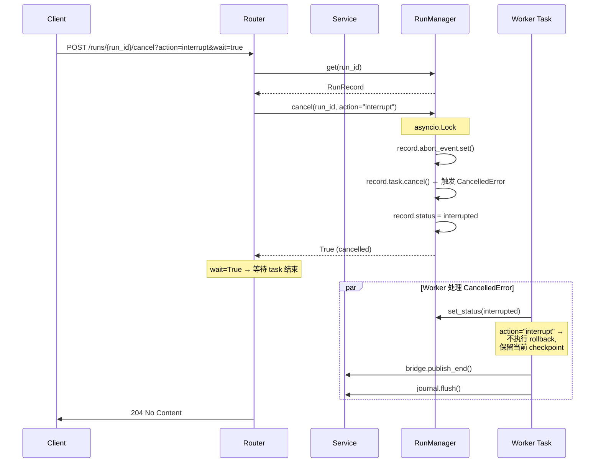
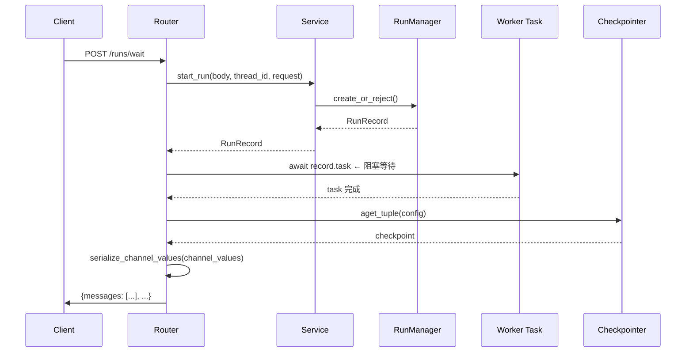

# Thread Runs API 调用链深度分析

> 面向面试的精读文档：理解 DeerFlow 如何实现 LangGraph Platform 兼容的 Runs API

---

## 目录

1. [API 总览](#1-api-总览)
2. [逐端点调用链分析](#2-逐端点调用链分析)
3. [架构层分解](#3-架构层分解)
4. [Mermaid 交互时序图](#4-mermaid-交互时序图)
5. [设计亮点总结](#5-设计亮点总结)
6. [Agent 面试重点](#6-agent-面试重点)

---

## 1. API 总览

**文件**: `backend/app/gateway/routers/thread_runs.py`  
**Router**: `APIRouter(prefix="/api/threads", tags=["runs"])`  
**核心职责**: 实现 LangGraph Platform runs API 的子集，支持创建、流式、等待、取消、消息查询等全生命周期管理。

### 1.1 端点清单

| 端点 | 方法 | 用途 | 响应样式 |
|------|------|------|----------|
| `/{thread_id}/runs` | POST | 后台创建 Run（立即返回） | JSON |
| `/{thread_id}/runs/stream` | POST | 创建 Run + SSE 流式 | SSE |
| `/{thread_id}/runs/wait` | POST | 创建 Run + 阻塞等待完成 | JSON |
| `/{thread_id}/runs` | GET | 列举 Thread 的所有 Runs | JSON |
| `/{thread_id}/runs/{run_id}` | GET | 获取 Run 详情 | JSON |
| `/{thread_id}/runs/{run_id}/cancel` | POST | 取消 Run（interrupt/rollback） | HTTP |
| `/{thread_id}/runs/{run_id}/join` | GET | 加入已有 Run 的 SSE 流 | SSE |
| `/{thread_id}/runs/{run_id}/stream` | GET/POST | 加入/取消后继续流式 | SSE |
| `/{thread_id}/messages` | GET | 跨 Run 的消息列表（含反馈） | JSON |
| `/{thread_id}/runs/{run_id}/messages` | GET | 单 Run 分页消息 | JSON |
| `/{thread_id}/runs/{run_id}/events` | GET | 全事件流（调试/审计） | JSON |
| `/{thread_id}/token-usage` | GET | Thread 级别 token 用量聚合 | JSON |

### 1.2 请求模型核心字段（`RunCreateRequest`）

```python
class RunCreateRequest(BaseModel):
    assistant_id: str | None          # 选择哪个agent
    input: dict[str, Any] | None      # 图输入（如 {messages: [...]}）
    command: dict[str, Any] | None    # LangGraph Command
    metadata: dict[str, Any] | None   # 运行元数据
    config: dict[str, Any] | None     # RunnableConfig 覆盖
    context: dict[str, Any] | None    # DeerFlow 自定义上下文（model_name, thinking_enabled等）
    stream_mode: list[str] | str | None  # 流模式
    on_disconnect: Literal["cancel", "continue"]  # 客户端断开行为
    multitask_strategy: Literal["reject", "rollback", "interrupt", "enqueue"]  # 并发策略
    checkpoint_id / checkpoint       # 状态恢复
    interrupt_before / interrupt_after  # 中断节点控制
    after_seconds: float | None       # 延迟执行
```

> **面试亮点**: 该模型覆盖了 LangGraph Platform 的完整参数集，同时通过 `context` 扩展了 DeerFlow 专属的运行时配置（model_name, thinking_enabled, agent_name 等），体现了"协议兼容 + 扩展"的设计哲学。

---

## 2. 逐端点调用链分析

### 2.1 `POST /{thread_id}/runs` — 创建后台 Run

```
API 层                        Service 层                      Runtime 层
│                             │                              │
│ body, thread_id             │                              │
│   │                        │                              │
│   ▼                        │                              │
│ start_run() ──────────────►│                              │
│                            │   run_mgr.create_or_reject()  │
│                            │       │                       │
│                            │       ▼                       │
│                            │   [冲突检测]                   │
│                            │   reject / interrupt / rollback│
│                            │       │                       │
│                            │       ▼                       │
│                            │   RunRecord created           │
│                            │                              │
│                            │   thread_store.upsert()       │
│                            │   (auto-create thread meta)   │
│                            │                              │
│                            │   build_run_config()          │
│                            │   normalize_input()           │
│                            │   merge_run_context_overrides()│
│                            │                              │
│                            │   asyncio.create_task(        │
│                            │     run_agent(bridge, ...)    │
│                            │   ) ─────────────────────────►│
│                            │                              │  set_status(running)
│                            │                              │  bridge.publish("metadata")
│                            │                              │  agent_factory(config)
│                            │                              │  agent.astream(input)
│                            │                              │  bridge.publish(event, data)
│                            │                              │  set_status(success/error)
│                            │                              │  bridge.publish_end()
│                            │                              │  journal.flush()
│                            │                              │
│  ◄── RunResponse ──────────┤                              │
│                            │                              │
```

**关键设计**:
- `start_run()` 是核心工厂函数——它**立即返回** `RunRecord`，实际执行通过 `asyncio.create_task` 异步进行
- `create_or_reject()` 用 `asyncio.Lock` 原子化地执行"检查 inflight → 创建 run"，消除 TOCTOU 竞态
- 自动 upsert `threads_meta` 表，确保即使通过 SDK 隐式创建的 thread 也能被 `/threads/search` 检索

---

### 2.2 `POST /{thread_id}/runs/stream` — 创建 Run + SSE 流式

```
Client                    Gateway                          Worker (asyncio.Task)      StreamBridge
  │                        │                                     │                     │
  │ POST /runs/stream      │                                     │                     │
  │───────────────────────►│                                     │                     │
  │                        │  start_run()                        │                     │
  │                        │     │─── asyncio.create_task() ────►│                     │
  │                        │                                     │                     │
  │                        │  StreamingResponse(                  │                     │
  │                        │    sse_consumer(                     │                     │
  │                        │      bridge, record,                 │                     │
  │                        │      request, run_mgr                │                     │
  │                        │  )                                   │                     │
  │◄── SSE Stream ─────────┤    )                                 │                     │
  │                        │                                     │                     │
  │                        │    │ subscribe(run_id) ──────────────┼──── subscribe ─────►│
  │                        │    │                                 │   publish("metadata")│
  │  event: metadata       │◄───┼─────────────────────────────────┼─────────────────────┤
  │  data: {run_id,...}    │    │                                 │                     │
  │                        │    │                                 │   publish("values")  │
  │  event: values         │◄───┼─────────────────────────────────┼─────────────────────┤
  │  data: {messages:...}  │    │                                 │                     │
  │                        │    │                                 │   publish("messages")│
  │  event: messages       │◄───┼─────────────────────────────────┼─────────────────────┤
  │  data: [chunk, meta]   │    │                                 │                     │
  │                        │    │                                 │   publish_end()      │
  │  event: end            │◄───┼─────────────────────────────────┼─────────────────────┤
  │                        │    │                                 │                     │
```

**关键设计**:
- `sse_consumer()` 是一个 **async generator**，通过 `bridge.subscribe()` 拉取事件并格式化为 SSE 帧
- SSE 格式与 LangGraph Platform 协议完全一致，使得 `@langchain/langgraph-sdk/react` 的 `useStream` Hook 可以无需修改直接使用
- `Content-Location` header 包含 run 的资源 URL，SDK 用贪心正则从此提取 run_id
- **断连处理**：在 `finally` 块中检查 `on_disconnect` 策略——`cancel` 则调用 `run_mgr.cancel()` 中止后台任务，`continue` 则静默丢弃剩余事件

---

### 2.3 `POST /{thread_id}/runs/wait` — 创建 Run + 阻塞等待

```python
record = await start_run(body, thread_id, request)
if record.task is not None:
    await record.task  # 直接 await 后台 asyncio.Task
# 然后从 checkpointer 获取最终 state
checkpoint_tuple = await checkpointer.aget_tuple(config)
channel_values = checkpoint.get("channel_values", {})
return serialize_channel_values(channel_values)
```

**关键设计**:
- `await record.task` 直接等待 asyncio Task 完成，无需 StreamBridge 介入
- 完成后通过 **checkpointer** 读取最终 checkpoint，返回 `channel_values`
- 异常路径降级返回错误信息，保证接口稳定性

---

### 2.4 `POST /{thread_id}/runs/{run_id}/cancel` — 取消 Run

```
request ──► run_mgr.get(run_id) ──► run_mgr.cancel(run_id, action)
                                        │
                                        ├── record.abort_event.set()
                                        ├── record.task.cancel()  ← asyncio 取消
                                        └── record.status = RunStatus.interrupted
                                              │
                                       wait=true? ───► await record.task (等待最终处理)
                                              │
                                              ▼
                                         204 / 202
```

**关键设计**:
- 两种回退策略:
  - `interrupt`: 保留当前 checkpoint，可 resume
  - `rollback`: 恢复运行前的 checkpoint 状态（在 `run_agent()` 的 `CancelledError` 处理中执行 `_rollback_to_pre_run_checkpoint()`）
- 通过 **`abort_event`（asyncio.Event）** 通知 worker 优雅停止，同时调用 `asyncio.Task.cancel()` 强行终止
- 结合 `wait` 参数控制是否同步等待完全结束

---

### 2.5 `GET /{thread_id}/messages` — 跨 Run 消息列表（含反馈）

```
request ──► event_store.list_messages(thread_id)   → 从 RunEventStore 获取消息
          ► feedback_repo.list_by_thread_grouped() → 从 FeedbackRepository 获取反馈
          ► 遍历消息，将 feedback 挂载到每个 run 的最后一条 AI 消息
```

**关键设计**:
- 消息和反馈**分别来自两个独立存储**（RunEventStore + FeedbackRepository），在 API 层做 join
- 使用 `before_seq` / `after_seq` 支持**双向游标分页**
- 反馈只附着在每个 run 的**最后一条 AI 消息**上，通过 `last_ai_per_run` 字典高效定位
- `limit <= 200` 有上限保护

---

### 2.6 辅助端点

| 端点 | 调用链 | 用途 |
|------|--------|------|
| `GET /{thread_id}/runs` | `run_mgr.list_by_thread()` | 列举 run |
| `GET /{thread_id}/runs/{run_id}` | `run_mgr.get()` + owner_check | run 详情 |
| `GET /{thread_id}/runs/{run_id}/join` | `bridge.subscribe()` → `sse_consumer()` | 加入已有 SSE 流 |
| `GET/POST /{thread_id}/runs/{run_id}/stream` | 可选 cancel + `sse_consumer()` | 加入或取消后流式 |
| `GET /{thread_id}/runs/{run_id}/messages` | `event_store.list_messages_by_run()` | 分页消息 |
| `GET /{thread_id}/runs/{run_id}/events` | `event_store.list_events()` | 全事件流调试 |
| `GET /{thread_id}/token-usage` | `run_store.aggregate_tokens_by_thread()` | Token 聚合 |

---

## 3. 架构层分解

### 3.1 四层架构总览

```
┌─────────────────────────────────────────────────────────────┐
│   Layer 1: API Router (thread_runs.py)                      │
│   - FastAPI 路由定义                                        │
│   - Pydantic 请求/响应模型                                   │
│   - @require_permission 权限装饰器                          │
│   - 薄层，所有业务逻辑委派到 Service 层                     │
├─────────────────────────────────────────────────────────────┤
│   Layer 2: Service (services.py)                            │
│   - start_run(): 创建 Run + 构建配置 + 启动后台 task        │
│   - sse_consumer(): SSE 帧生成器（async generator）         │
│   - SSE 格式化 (format_sse)                                  │
│   - 输入归一化 (normalize_input / normalize_stream_modes)   │
│   - 配置构建 (build_run_config)                              │
├─────────────────────────────────────────────────────────────┤
│   Layer 3: Runtime (deerflow.runtime)                       │
│   ├── RunManager: 运行注册表 + 并发控制 + 持久化            │
│   ├── run_agent(): agent 实际执行引擎                       │
│   ├── StreamBridge: 生产者/消费者事件管道                   │
│   ├── RunJournal: LangChain 回调处理器 → 事件持久化         │
│   ├── RunContext: 基础设施依赖聚合                          │
│   └── Serialization: 序列化工具集                            │
├─────────────────────────────────────────────────────────────┤
│   Layer 4: Persistence (deerflow.persistence)               │
│   ├── Checkpointer: 检查点存储 (SQLite/DB)                  │
│   ├── RunEventStore: 事件流存储 (DB/JSONL/Memory)           │
│   ├── RunStore: Run 元数据持久化                              │
│   ├── FeedbackRepository: 用户反馈存储                      │
│   ├── ThreadMetaStore: 线程元数据存储                       │
│   └── Store: LangGraph 内置持久化存储                       │
└─────────────────────────────────────────────────────────────┘
```

### 3.2 核心依赖注入模式

所有基础设施单例通过 FastAPI `app.state` 存储，路由器通过 `get_*()` 获取：

```python
# deps.py — 一次性创建
async with langgraph_runtime(app):
    app.state.stream_bridge = MemoryStreamBridge()
    app.state.checkpointer = await make_checkpointer(config)
    app.state.run_event_store = make_run_event_store(config)
    app.state.run_manager = RunManager(store=app.state.run_store)
    # ...

# 每个请求获取
get_stream_bridge(request)   → request.app.state.stream_bridge
get_run_manager(request)     → request.app.state.run_manager
get_checkpointer(request)    → request.app.state.checkpointer
get_run_context(request)     → RunContext(...)  # 聚合多个依赖
```

> **面试亮点**: 使用 `AsyncExitStack` 确保有序创建和关闭，`_require()` 工厂函数自动生成 getter 函数，统一 503 错误处理。

### 3.3 Producer-Consumer 模式：StreamBridge

```
Producer (Worker Task)                  Consumer (SSE Endpoint)
┌─────────────────────┐               ┌──────────────────────┐
│  agent.astream()    │               │  sse_consumer()      │
│       │             │               │       │              │
│       ▼             │               │       ▼              │
│  bridge.publish(    │               │  async for entry in  │
│    run_id,          │    asyncio    │    bridge.subscribe( │
│    event, data      │ ────Queue──►  │      run_id          │
│  )                  │   +Cond       │    ):                │
│       │             │               │       │              │
│       ▼             │               │       ▼              │
│  bridge.publish_end()│               │  yield format_sse() │
└─────────────────────┘               └──────────────────────┘
```

**关键特性**:
- **事件持久化**: MemoryStreamBridge 保留最近 256 个事件，支持 `Last-Event-ID` 断线重连
- **心跳**: `subscribe()` 在 `heartbeat_interval`（15s）内无事件时 yield `HEARTBEAT_SENTINEL`，SSE 输出 `: heartbeat\n\n`
- **Sentinel 模式**: `END_SENTINEL` / `HEARTBEAT_SENTINEL` 作为特殊事件标记

---

## 4. Mermaid 交互时序图

### 4.1 创建 + SSE 流式（核心流程全链路）

```mermaid
sequenceDiagram
    participant Client as Client (useStream Hook)
    participant Router as API Router (thread_runs.py)
    participant Auth as AuthZ (@require_permission)
    participant Service as Service Layer (services.py)
    participant RunMgr as RunManager
    participant StreamB as StreamBridge (Memory)
    participant Worker as Worker Task (run_agent)
    participant Agent as Agent Graph
    participant Journal as RunJournal
    participant Chkptr as Checkpointer
    participant EventDB as RunEventStore
    participant ThreadDB as ThreadMetaStore

    Client->>Router: POST /api/threads/{id}/runs/stream
    
    Note over Router,Auth: @require_permission("runs", "create")<br/>owner_check=True
    Router->>Auth: Check JWT cookie (access_token)
    Auth->>Auth: Validate token + user permissions
    Auth->>ThreadDB: check_access(thread_id, user_id)
    ThreadDB-->>Auth: allowed
    Auth-->>Router: ✓

    Router->>Service: start_run(body, thread_id, request)

    Service->>RunMgr: create_or_reject(thread_id, assistant_id,<br/>multitask_strategy="reject")
    
    Note over RunMgr: asyncio.Lock 保护
    RunMgr->>RunMgr: 检查 inflight runs
    RunMgr-->>Service: RunRecord (status=pending)

    Service->>ThreadDB: upsert thread metadata
    ThreadDB-->>Service: ✓

    Service->>Service: build_run_config(thread_id, config, metadata)
    Service->>Service: normalize_input(input)
    Service->>Service: merge_run_context_overrides(config, context)
    
    Note over Service: asyncio.create_task()
    Service-->>Worker: run_agent(bridge, run_mgr, record, ctx,<br/>agent_factory, graph_input, config, stream_modes)
    
    Service->>Router: RunRecord
    Router->>Client: StreamingResponse(sse_consumer(bridge, record, request, run_mgr))

    par Worker Task (background)
        Worker->>RunMgr: set_status(running)
        Worker->>Chkptr: aget_tuple(config) [pre-run snapshot]
        Worker->>StreamB: publish("metadata", {run_id, thread_id})
        
        Worker->>Worker: _build_runtime_context(thread_id, run_id)
        Worker->>Worker: agent_factory(config) → agent
        
        Worker->>Agent: agent.astream(graph_input, config, stream_mode=["values", "messages"])
        
        loop agent.astream()
            Agent-->>Worker: (values, full_state)
            Worker->>StreamB: publish("values", serialize(state))
            
            Agent-->>Worker: (messages, (chunk, metadata))
            Worker->>StreamB: publish("messages", serialize(chunk, mode="messages"))
            
            Worker->>Journal: on_llm_end/on_chat_model_start [回调捕获]
            Journal->>Journal: 累积 token usage
            Journal->>EventDB: put_batch(events) [定期刷入]
        end
        
        Note over Worker: abort_event 检查 → 支持优雅中止
        
        Worker->>RunMgr: set_status(success / error / interrupted)
        Worker->>Journal: flush()
        Worker->>Journal: get_completion_data()
        Worker->>RunMgr: update_run_completion(tokens, counts)
        Worker->>Chkptr: 同步 title → thread_store
        Worker->>ThreadDB: update_status(idle / running / error)
        Worker->>StreamB: publish_end()
        Worker->>StreamB: cleanup(run_id, delay=60s)
    end

    par SSE Consumer (main asyncio.Task)
        Router->>StreamB: subscribe(run_id, last_event_id=...)
        
        loop until END_SENTINEL
            Note over Router: async for entry in subscribe()
            Router->>Client: event: metadata<br/>data: {run_id, thread_id}
            Router->>Client: event: values<br/>data: {messages: [...]}
            Router->>Client: event: messages<br/>data: [chunk, metadata]
            Router->>Client: event: messages<br/>data: [chunk, metadata]
            alt 15s 无事件
                Router->>Client: : heartbeat\n\n
            end
            break if request.is_disconnected()
        end
        
        Router->>Client: event: end<br/>data: null
    end
    
    Note over Client: useStream React Hook<br/>解析 SSE 事件<br/>重组消息流
    
    alt on_disconnect == "cancel"
        Note over Router: finally 块中调用<br/>run_mgr.cancel()
    end
```

### 4.2 取消流程（interrupt / rollback）



### 4.3 等待完成流程 (`/wait`)



---

## 5. 设计亮点总结

### 5.1 架构级亮点

| 亮点 | 说明 | 面试话术要点 |
|------|------|-------------|
| **LangGraph Platform 兼容** | SSE 格式、`Content-Location` header、流模式命名、`useStream` Hook 兼容 | "直接兼容 LangGraph SDK 的 React Hook，用户无感知迁移" |
| **四层分离** | API Router → Service → Runtime → Persistence，职责清晰 | "每一层只做一件事：Router 处理 HTTP 协议，Service 编排业务，Runtime 执行 agent，Persistence 负责存储" |
| **生产者-消费者解耦** | StreamBridge 隔离 worker 和 SSE consumer | "worker 只管发布事件，不需要知道是 HTTP SSE、WebSocket 还是内部通道消费" |
| **多层持久化** | 运行中只存内存，关键状态持久化到 DB | "RunRecord 在内存 + 可选的 RunStore 持久化；事件流通过 RunJournal 缓冲区异步刷入；checkpoint 通过 checkpointer 确保可恢复" |

### 5.2 技术实现亮点

| 亮点 | 代码位置 | 设计意图 |
|------|---------|---------|
| **`create_or_reject()` 原子操作** | `manager.py:165-229` | 用同一个 `asyncio.Lock` 包裹"检查 inflight + 创建 run"，消除 TOCTOU 竞态 |
| **`abort_event` + `task.cancel()` 双重中断** | `manager.py:140-163` | asyncio.Event 通知优雅退出，Task.cancel() 保证强制终止，两者结合无盲区 |
| **`RunJournal` 回调 + 缓冲区** | `journal.py` | LangChain BaseCallbackHandler 捕获 token 用量 + LLM 调用 + 中间件事件；写缓冲区在达到阈值或 finally 块中异步刷入 |
| **`_rollback_to_pre_run_checkpoint()`** | `worker.py:411-501` | 运行前深拷贝 checkpoint，取消时完整恢复到运行前状态，支持 pending_writes 重放 |
| **双向游标分页** | `events/store/base.py` | `before_seq` / `after_seq` 支持正反向翻页，不依赖 LIMIT OFFSET 的末尾倾斜问题 |
| **`merge_run_context_overrides()`** | `services.py:122-136` | 将 body.context 中的 whitelist 键同时注入 `configurable` 和 `context`，同时兼容 LangGraph <0.6 和 >=1.1.9 |
| **SSE 心跳 + 断线重连** | `memory.py:85-123` | `asyncio.wait_for(condition.wait(), timeout=15)` 实现定频心跳；`Last-Event-ID` + offset 偏移量做断线续传 |

### 5.3 容错与安全

| 特性 | 实现 |
|------|------|
| **权限控制** | `@require_permission("runs", "create", owner_check=True)` 在装饰器层做 JWT 认证 + owner 检查 |
| **断连保护** | SSE 的 `finally` 块根据 `on_disconnect` 策略自动取消或继续后台任务 |
| **异常隔离** | worker 的 try/except/finally 保证任何异常都不会导致 SSE 流挂起——总会发送 `end` 事件 |
| **资源清理** | `bridge.cleanup(run_id, delay=60)` 延迟释放 StreamBridge 资源，给迟到的 subscriber 机会 |
| **优雅降级** | 大量 `logger.warning` + try/except 保护辅助操作（如 thread_store 写入失败）不阻碍主流程 |

---

## 5.4 并发策略深度解析（Multitask Strategy）

`multitask_strategy` 是 DeerFlow API 中最具面试价值的复杂设计之一。它解决的核心问题是：

> **同一个 thread 上，新 run 请求到达时已有 run 在执行，服务端该如何处理？**

它在请求模型的定义位置：

```python
# thread_runs.py → RunCreateRequest
multitask_strategy: Literal["reject", "rollback", "interrupt", "enqueue"]
                    = Field(default="reject", description="Concurrency strategy")
```

### 5.4.1 代码实现：`create_or_reject()`

实现位置: `backend/packages/harness/deerflow/runtime/runs/manager.py`

```python
async def create_or_reject(self, ..., multitask_strategy="reject"):
    async with self._lock:  # ← ① asyncio.Lock 保护，无 TOCTOU 竞态
        # ② 找出该 thread 下所有的 inflight run
        inflight = [r for r in self._runs.values()
                    if r.thread_id == thread_id
                    and r.status in (RunStatus.pending, RunStatus.running)]

        if multitask_strategy == "reject" and inflight:
            raise ConflictError("Thread 已有活跃 run")  # → 409

        if multitask_strategy in ("interrupt", "rollback") and inflight:
            for r in inflight:
                r.abort_action = multitask_strategy
                r.abort_event.set()      # ③ 优雅中断信号
                r.task.cancel()          # ④ 强制触发 CancelledError
                r.status = RunStatus.interrupted

        # ⑤ 创建新 RunRecord
```

**五个关键设计**：

| 编号 | 设计 | 意图 |
|------|------|------|
| ① | `asyncio.Lock` | 检查 inflight + 创建 run 是原子操作，消除 TOCTOU（Time-of-Check-Time-of-Use）竞态 |
| ② | 只查 `pending` / `running` | 已完成或已失败的 run 不阻挡新请求 |
| ③ | `abort_event.set()` | 通过 asyncio.Event 通知 worker 的 `agent.astream()` 主循环优雅退出 |
| ④ | `task.cancel()` | 强制触发 `asyncio.CancelledError`，保证旧 run 无论如何都会停止 |
| ⑤ | 创建新 RunRecord | 全部在 Lock 内完成，外部观察不到中间状态 |

### 5.4.2 四种策略的产品形态对比

| 策略 | 技术行为 | 旧 run 状态 | 产品 UX | 适用场景 | 面试关键词 |
|------|---------|------------|---------|---------|-----------|
| **reject**（默认） | 新请求被拒绝，抛 409 Conflict | 不受影响，继续运行 | 前端弹提示："当前已有对话在处理中" | 用户误操作连点提交、防重复提交 | 安全默认值 |
| **interrupt** | 取消旧 run，保留 checkpoint，启动新 run | checkpoint 保留，**后续可 resume** | 旧回答消失，agent 立即开始回答新问题 | 用户中途改变主意、发新消息 | 优雅中断 + 可恢复 |
| **rollback** | 取消旧 run，恢复运行前 checkpoint，启动新 run | checkpoint 恢复到运行前，**仿佛旧 run 未发生过** | 对话干净重置，旧 run 的副作用完全撤销 | 旧 run 产生了副作用（写文件/调 API）且用户想重来 | 状态回滚 + 副作用消除 |
| **enqueue**（未实现） | 新请求入队，等前序 run 完成后自动执行 | 排队等待 | 任务排队中，稍后自动执行 | 批量异步任务提交（非对话场景） | 异步队列 + 上下文隔离 |

### 5.4.3 `interrupt` —— 同一 thread 上下文切换深度分析

`interrupt` 是整个策略体系中最核心、也最有面试价值的设计。

**场景复原**：

```
thread_id=abc  (同一个对话会话)
├── Run A (run_id=a1, status=running)  ─── agent 正在分析财务报表
│
├── 用户发新消息: "算了，先帮我查天气"
│   → POST /api/threads/abc/runs/stream, multitask_strategy=interrupt
│
├── Run A 被中断: abort_event.set() + task.cancel()
│   → status=interrupted, A 产生的消息/状态保留在 checkpointer 中
│
└── Run B (run_id=b2, status=running)  ─── 启动新 run
    graph_input 包含用户的新消息
    agent.astream() 从 thread_id=abc 的最新 checkpoint 继续
```

**关键问题：为什么新旧 run 是同一个 thread_id？**

因为 REST 路由是：
```python
@router.post("/{thread_id}/runs/stream")
```
run A 和 run B 都通过 `/api/threads/abc/runs/stream` 进入。`create_or_reject()` 按 `thread_id` 查找 inflight run，新旧 run 自然属于同一 thread。

**这对产品体验的影响**：
- LangGraph 的 checkpointer 以 `(thread_id, checkpoint_id)` 为键存储状态
- Run A 被 interrupt 时，它已经产生的消息和状态已写入 `thread_id=abc` 的检查点链
- Run B 启动后，agent 的输入上下文中包含了 Run A 产生的部分状态（加上用户的新输入）
- 用户看到的是**同一个对话里，agent 转向回答新问题，同时保留历史上下文**

**`interrupt` vs `rollback` 的本质区别**：

```
interrupt: Run A 的消息 ✓保留 → Run B 能看到对话历史
rollback:  Run A 的消息 ✗回滚 → Run B 从干净的 checkpoint 开始
```

后者通过 `worker.py` 的 `_rollback_to_pre_run_checkpoint()` 实现——将 checkpointer 中该 thread 的 checkpoint 恢复到 run 启动前深拷贝的快照。

### 5.4.4 `enqueue` —— 为什么不适合对话场景

`enqueue` 当前抛 `UnsupportedStrategyError`，属于**协议层面预留但实现层面标记为不支持**。它为什么没做？因为对对话式 AI 场景来说排队有严重问题：

```
用户连续输入两条消息:
  输入1: "天气怎么样？"      → Run A 开始
  输入2: "帮我订个餐厅"      → Run B 入队（enqueue）

Run A 完成 → AI: "今天25度，晴天"
Run B 启动 → AI 看到聊天历史里有"今天25度，晴天"
             + 用户输入"帮我订个餐厅"
             → "好的，订什么时间的？"   ← ❌ 上下文错位！
```

用户输入"帮我订个餐厅"时还没有看到"今天25度"的回答——它的语境是输入1之前的历史。但进入 Run B 时，上下文已经被 Run A 的回答污染了，导致 Run B 表现出**不该有的"记忆"**，用户体验极差。

**如果 `enqueue` 要做，产品形态应该是后台任务队列，不是对话消息排队：**

```
thread = "翻译工作区"（非对话，而是任务列表）

用户提交三个独立任务:
  Run A: "翻译 file1.docx 为中文"    → 自包含指令，不依赖连续对话
  Run B: "翻译 file2.docx 为中文"    → 入队
  Run C: "翻译 file3.docx 为中文"    → 入队

A → B → C 依次独立执行
每个 run 的输入互不依赖，结果独立
用户提交后可以离开页面，回头查看结果
```

**对话场景 vs 任务场景的本质区别**：

| 维度 | 对话 (reject/interrupt/rollback) | 后台任务 (enqueue) |
|------|----------------------------------|-------------------|
| 输入依赖 | 依赖对话历史的连续性 | 自包含指令 |
| 用户等待 | 在线，等待实时回复 | 离线，回头查看 |
| run 间关系 | 互斥（同一对话只能有一个声音） | 独立（互不干扰） |
| 上下文 | 共享 thread 状态 | 每个 run 独立上下文 |
| 错误影响 | 立即可见，需要即时处理 | 可异步通知 |

这也是为什么 `reject` 作为默认值最安全——对聊天场景来说，最自然的体验就是"一次只聊一个话题"。

### 5.4.5 配置位置

`multitask_strategy` 的配置有三层：

| 层面 | 位置 | 说明 |
|------|------|------|
| **API 请求体** | `RunCreateRequest.multitask_strategy` | 每次 create run 时可以指定，前端可自由选择 |
| **Pydantic 默认值** | `thread_runs.py` Field(default="reject") | 客户端不传时使用 reject |
| **前端/IM 通道隐式选择** | Web UI / Slack / Feishu / Telegram | 各通道根据自身交互模式硬编码合适的策略 |

典型的产品级策略分配：

| 前端通道 | 使用的策略 | 原因 |
|---------|-----------|------|
| Web UI 普通对话 | `reject`（走默认） | 防重复提交 |
| Web UI 用户主动重发 | `interrupt` | 旧回答让位，新回答开始 |
| Web UI "撤销/重来" | `rollback` | 完全回退到之前的状态点 |
| Slack/Telegram | 隐式串行（阻塞式 wait） | 消息通道天然单线程 |
| 批量 API 客户端 | `reject` 或自定义排队逻辑 | 由客户端自行控制并发 |

---

## 5.5 异步事件通知模式解析

DeerFlow 在 Run 生命周期管理和事件流中使用了三种不同的异步通知机制。理解它们的区别和适用场景，是面试中展示"对 Python asyncio 有深入理解"的亮点。

### 5.5.1 `asyncio.Event` —— 一次性信号通知

**用途**：取消/中断指令（一次性的"开关信号"）

**核心代码**：

```python
# manager.py — RunRecord 定义
@dataclass
class RunRecord:
    abort_event: asyncio.Event = field(default_factory=asyncio.Event, repr=False)
    #                 ↑ 默认未设置（False），worker 正常运行

# manager.py — cancel() 方法（信号生产者）
async def cancel(self, run_id, *, action="interrupt"):
    record.abort_action = action
    record.abort_event.set()          # ← 设置事件，通知 worker 停止

# worker.py — 主循环（信号消费者）
async for chunk in agent.astream(...):
    if record.abort_event.is_set():    # ← 轮询检查事件是否被设置
        break                          # 优雅退出
```

**特点**：

| 特性 | 说明 |
|------|------|
| **一次性** | `set()` 后事件永远处于"已设置"状态，不能复用（除非 `clear()`） |
| **边缘触发** | worker 只能知道"有没有发生过"，无法知道"发生了几次" |
| **适用场景** | 中断信号、关闭信号、开始信号——只需要触发一次的通知 |
| **线程安全** | 是，asyncio.Event 内部使用 `asyncio.locks._EventLoopBoundMixin`，可在协程间安全共享 |

**面试重点**：`asyncio.Event` 是一个 **level-triggered**（电平触发）的原语。一旦 `set()`，所有 `is_set()` 或 `wait()` 调用都会立即返回 `True`，不需要"重新触发"。这对于中断场景非常合适——worker 可以用 `if is_set(): break` 在循环中检查，也可以在任意位置用 `await wait()` 阻塞等待。而 `clear()` 可以将其重置为未设置状态，但 DeerFlow 在这里直接丢弃整个 `RunRecord`（通过 `cleanup()`），所以不需要 `clear()`。

**使用模式：一次检查 vs 持续等待**

```python
# 模式 A: 轮询检查（worker.py 使用）
if record.abort_event.is_set():
    break   # 不阻塞，只是检查一下

# 模式 B: 阻塞等待（未使用，但也是标准用法）
await record.abort_event.wait()  # 阻塞直到事件被设置
```

### 5.5.2 `asyncio.Condition` —— 可重复的通知通道

**用途**：StreamBridge 的生产者-消费者事件分发（反复发生的通知）

**核心代码**：

```python
# memory.py — _RunStream 定义
@dataclass
class _RunStream:
    events: list[StreamEvent] = field(default_factory=list)
    condition: asyncio.Condition = field(default_factory=asyncio.Condition)
    #               ↑ 与 Event 不同，Condition 可以在 wait/notify 之间循环

# 生产者（Worker）：publish() — 每发布一个事件就通知所有消费者
async def publish(self, run_id, event, data):
    stream = self._get_or_create_stream(run_id)
    async with stream.condition:                    # ← 获取 Condition 锁
        stream.events.append(entry)                 # ← 追加事件
        stream.condition.notify_all()               # ← 唤醒所有等待的消费者

# 消费者（SSE）：subscribe() — 等待新事件到来
async def subscribe(self, run_id, ...):
    while True:
        async with stream.condition:                # ← 获取同样的锁
            if 有新事件可读:
                yield event                         # ← 立即返回
                continue
            await stream.condition.wait()           # ← 没有事件？阻塞等待
```

**`asyncio.Condition` vs `asyncio.Event` 的核心区别**：

| 维度 | `asyncio.Event` | `asyncio.Condition` |
|------|----------------|-------------------|
| **触发次数** | 一次性 (`set()` 后永久有效) | 可重复 (`notify()` / `wait()` 循环) |
| **是否需要锁** | 否（内部有锁，外部不暴露） | 是（必须 `async with` 获取内部 Lock） |
| **唤醒行为** | 所有 wait 者收到 | `notify(n)` 唤醒 n 个，`notify_all()` 唤醒全部 |
| **典型场景** | 中断信号、关闭标志 | 生产者-消费者队列、工作队列 |

**面试重点**：`Condition` 的本质是 **`Lock` + `Event`** 的组合体。`async with condition` 获取其内部的 `Lock`，修改共享状态后 `notify()`，消费者在 `wait()` 中释放锁并阻塞，被唤醒后重新获取锁。这个设计保证了：
1. 修改共享状态（`stream.events`）时不会有竞态
2. 消费者不会错过通知（先检查条件再 wait，没有 TOCTOU）

```python
# Condition 的"伪代码"大致等价于:
class Condition:
    async def wait(self):
        self._lock.release()     # 释放锁，让生产者能修改状态
        await self._event.wait() # 阻塞等待通知
        self._lock.acquire()     # 重新获取锁后返回

    def notify(self):
        self._event.set()        # 唤醒等待者
        self._event.clear()      # 立即重置，以便下次循环
```

这正是本例中 `subscribe()` 的工作方式——每次在循环中检查是否有新事件、没有则 `wait()`、被 `notify_all()` 唤醒后再次检查。

### 5.5.3 `Task.add_done_callback()` —— 异步任务的完成回调

**用途**：RunJournal 的缓冲区刷盘——异步任务完成后的收尾处理

**核心代码**：

```python
# journal.py
def _flush_sync(self) -> None:
    loop = asyncio.get_running_loop()
    task = loop.create_task(self._flush_async(batch))   # ← 创建异步刷盘任务
    self._pending_flush_tasks.add(task)
    task.add_done_callback(self._on_flush_done)          # ← 注册完成回调

def _on_flush_done(self, task: asyncio.Task) -> None:
    self._pending_flush_tasks.discard(task)              # ← 从待清理集合中移除
    if task.cancelled():
        return
    exc = task.exception()                               # ← 检查异常
    if exc:
        logger.warning("Journal flush task failed: %s", exc)
```

**设计背景**：LangChain 的 `BaseCallbackHandler` 方法是同步的（Sync），但写数据库需要异步操作（Async）。解决方案是在同步方法中通过 `loop.create_task()` 调度异步任务，然后通过 `add_done_callback()` 注册一个同步回调来处理结果。

**特点**：

| 特性 | 说明 |
|------|------|
| **触发时刻** | `asyncio.Task` 完成（成功/异常/取消）时触发 |
| **回调上下文** | 在事件循环中执行，但不作为协程 |
| **典型用途** | 清理资源、记录日志、通知状态变更 |
| **注意** | 回调中不能 `await`；如果需要异步操作，应在回调中 `create_task()` |

### 5.5.4 三种模式的对比总结

| 模式 | asyncio 原语 | 触发方式 | 循环支撑 | 位置 | 用途 |
|------|------------|---------|---------|------|------|
| **abort_event** | `asyncio.Event` | `set()` → `is_set()` | 否（一次性） | `manager.py` / `worker.py` | 中断信号：RunManager 告诉 Worker 停止执行 |
| **StreamBridge 通知** | `asyncio.Condition` | `notify_all()` → `wait()` | 是（可重复） | `memory.py` | 事件分发：Worker 告诉 SSE Consumer 新事件来了 |
| **flush 完成回调** | `Task.add_done_callback()` | Task 完成自动触发 | 否（单次） | `journal.py` | 异步收尾：刷盘完成后清理 pending 集合 |

**三者解决的问题不同**：

```
                          abort_event (一次性中断信号)
                          ──────────────────────────────
  RunManager                         │
      │  "停下！"                    │ set()
      ▼                              ▼
  Worker ─────────────────▶ agent.astream() ──▶ break
                          if is_set()

                          Condition (可重复通知通道)
                          ──────────────────────────────
  Worker (生产者)                   │
      │  "新数据来了"              │ notify_all()
      ▼                              ▼
  SSE Consumer ───────────────▶ yield event
                          wait() → 被唤醒

                          add_done_callback (完成回调)
                          ──────────────────────────────
  同步回调函数                       │
      │  "去刷盘"                   │ create_task()
      ▼                              ▼
  async flush ─────────────────▶ 回调收到通知
                          add_done_callback()
```

### 5.5.5 面试 Q&A

> **Q: "asyncio.Event 和 asyncio.Condition 有什么区别？分别在 DeerFlow 的哪里用到了？"**
>
> **回答**：
> - **Event** 是一次性的信号开关。DeerFlow 在 `RunRecord.abort_event` 中使用它——RunManager 调用 `cancel()` 时 `set()`，Worker 在 `agent.astream()` 每次迭代中 `is_set()` 检查。适用场景是中断指令：只需要通知一次"停下吧"
> - **Condition** 是可重复的通知通道。DeerFlow 在 `MemoryStreamBridge._RunStream.condition` 中使用它——Worker `publish()` 后 `notify_all()`，SSE Consumer 在 `subscribe()` 的循环中 `wait()` 阻塞等待。适用场景是事件流：每来一个新事件就需要通知一次，并且需要锁来保护共享的 events 列表
> - 选择原则：**一次性通知用 `Event`，多次重复通知用 `Condition`**

> **Q: "为什么 RunJournal 的 flush 要用 create_task + add_done_callback，而不是直接用 await？"**
>
> **回答**：
> - LangChain 的 `BaseCallbackHandler` 回调方法是同步的（Sync），内部无法 `await`
> - 但写数据库是异步操作（async SQLAlchemy）
> - 解决方案：在同步方法中通过 `loop.create_task()` 创建协程任务，注册 `add_done_callback()` 来收尾
> - 同时用 `_pending_flush_tasks` 集合防止并发刷盘——如果已有任务在跑，新的事件留在缓冲区里
> - 这就是 Python 中"同步 → 异步"桥接模式的标准做法

---

## 6. Agent 面试重点

### 6.1 如果你要在面试中展示"精通 DeerFlow 架构"

#### Q1: "DeerFlow 如何实现 LangGraph 兼容的 Runs API？"

```
回答骨架:
1. 路由层 (thread_runs.py) 定义标准 REST 端点，使用 FastAPI + APIRouter
2. 服务层 (services.py) 的 start_run() 组装请求，通过 RunManager 创建 RunRecord
3. 核心执行委托给 deerflow.runtime.run_agent()，使用 agent.astream() 驱动 LangGraph 图
4. 流式支持通过 StreamBridge 解耦 worker 和 SSE consumer，事件格式对齐 LangGraph Platform
5. SSE 包含 Content-Location header，useStream React Hook 可零修改工作
```

#### Q2: "多任务并发策略（multitask_strategy）是如何实现的？"

```
回答骨架:
- reject: create_or_reject() 检查 thread 是否有 inflight run，有则抛出 ConflictError(409)
- interrupt: 取消已有 run (abort_event + task.cancel())，保留其 checkpoint
- rollback: 取消 run 并恢复运行前 checkpoint (通过运行前深拷贝)
- enqueue: 标记为 "not yet supported"，架构上预留了扩展点
所有操作在 asyncio.Lock 保护下原子执行
```

#### Q3: "StreamBridge 的设计思路是什么？"

```
回答骨架:
- 标准的 Producer-Consumer 模式
- Worker 通过 publish() 发布事件，HTTP consumer 通过 subscribe() 消费
- MemoryStreamBridge 使用 asyncio.Condition + list 实现线程安全的阻塞队列
- 支持心跳 (15s 自动心跳帧)、断线重连 (Last-Event-ID + offset 定位)
- 事件缓冲区保留上限 256 条，防止堆积
- 接口抽象化 (StreamBridge ABC)，可替换为 Redis 等其他后端
```

#### Q4: "一次 SSE 流式请求的完整生命周期？"（考察全链路理解）

```
1. 请求到达 FastAPI → @require_permission 鉴权
2. services.start_run() 创建 RunRecord → asyncio.create_task(run_agent())
3. run_agent() 设置 checkpointer、agent_factory、运行前快照
4. 发布 metadata 事件 → worker 进入 agent.astream() 主循环
5. 每个 stream_mode 的数据通过 bridge.publish() 发送
6. 同时 RunJournal 回调处理器捕获 token 用量 + LLM 调用
7. StreamBridge 的 subscribe() 通过 asyncio.Condition.wait() 阻塞等待新事件
8. sse_consumer() async generator 将事件格式化为 SSE 帧 yield 回客户端
9. worker 完成后发布 end 事件 + journal.flush() + 清理
10. 客户端收到 end 事件后关闭 SSE 连接
```

#### Q5: "DeerFlow 的持久化策略？"

```
回答骨架:
- 三层持久化: checkpoint (状态恢复) + run_event_store (事件审计) + run_store (元数据)
- RunJournal 作为 LangChain 回调将 LLM 调用、token 用量、中间件事件写入 RunEventStore
- 写缓冲区 + 批量刷入 (put_batch) 控制 IO 频率
- FeedbackRepository 独立存储用户反馈
- ThreadMetaStore 跟踪线程状态和所有权（用于权限检查）
```

### 6.2 值得深入的技术细节

1. **LangGraph 的 `config` 与 `context` 演进**：
   - `<0.6` 使用 `configurable` → `>=0.6` 引入 `context` → `>=1.1.9` 停止 fallback
   - DeerFlow 通过 `merge_run_context_overrides()` 同时写入两个位置保证兼容性

2. **`__pregel_runtime` 注入**：
   - 手动构造 `Runtime(context, store)` 并注入到 `config["configurable"]["__pregel_runtime"]`
   - 这是 LangGraph 在 CLI 模式自动完成的，DeerFlow 在嵌入模式下需要手动做

3. **`_rollback_to_pre_run_checkpoint()` 实现细节**：
   - 运行前使用 `copy.deepcopy()` 快照 checkpoint、metadata、pending_writes
   - 回滚时用 `checkpointer.aput()` 恢复 + `aput_writes()` 重放未写入的 pending writes
   - 极端情况处理：无 checkpoint（清理整个 thread）、快照失败（跳过回滚）

4. **SSE 协议的精确实现**：
   - 严格按照 `event:` → `data:` → `id:` 顺序（LangGraph SDK 顺序依赖）
   - 每条 SSE 帧结尾有两个 `\n`（空行分割）
   - Heartbeat 帧使用 `: heartbeat\n\n`（SSE comment，客户端忽略）

---

## 附录：关键文件索引

| 文件 | 角色 | 阅读建议 |
|------|------|---------|
| `backend/app/gateway/routers/thread_runs.py` | API 路由器 | 入口，了解所有端点 |
| `backend/app/gateway/services.py` | 服务层 | 核心业务逻辑（start_run, sse_consumer） |
| `backend/app/gateway/deps.py` | 依赖注入 | 理解单例生命周期 |
| `backend/app/gateway/authz.py` | 权限系统 | 了解 @require_permission 实现 |
| `backend/packages/harness/deerflow/runtime/runs/manager.py` | Run 管理器 | RunRecord, RunManager 实现 |
| `backend/packages/harness/deerflow/runtime/runs/worker.py` | Agent 执行引擎 | 最核心：run_agent + 回滚 |
| `backend/packages/harness/deerflow/runtime/runs/schemas.py` | 枚举定义 | RunStatus, DisconnectMode |
| `backend/packages/harness/deerflow/runtime/stream_bridge/memory.py` | 内存流桥 | Producer-Consumer 实现 |
| `backend/packages/harness/deerflow/runtime/stream_bridge/base.py` | 桥抽象基类 | StreamBridge 协议定义 |
| `backend/packages/harness/deerflow/runtime/journal.py` | 回调捕获 | RunJournal → 事件持久化 |
| `backend/packages/harness/deerflow/runtime/serialization.py` | 序列化 | LangChain 对象 → JSON |
| `backend/packages/harness/deerflow/runtime/events/store/base.py` | 事件存储接口 | RunEventStore 抽象 |
| `backend/packages/harness/deerflow/runtime/events/store/db.py` | 数据库事件存储 | SQLAlchemy 实现 |
