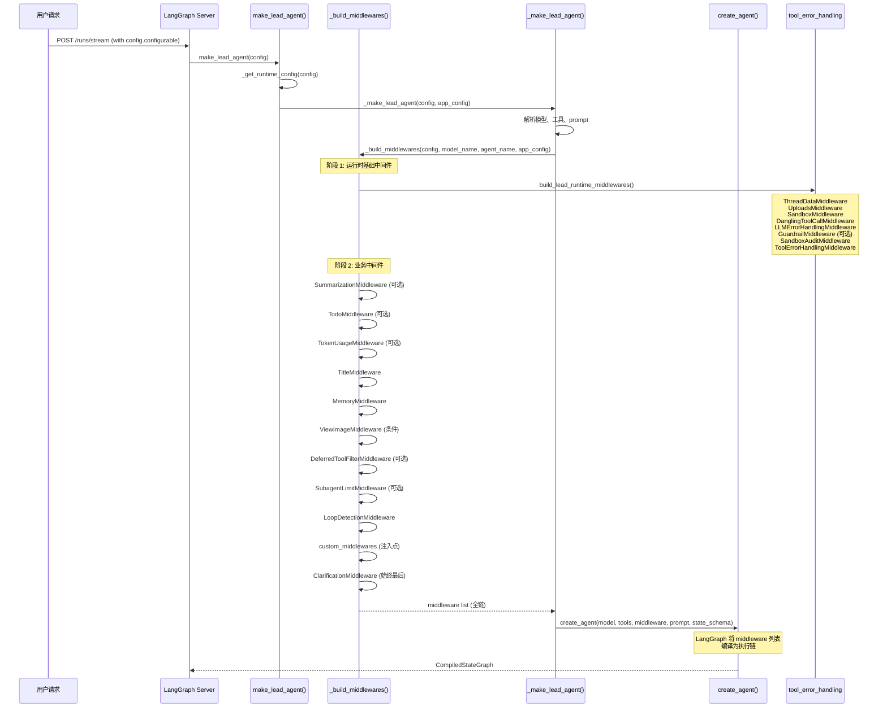
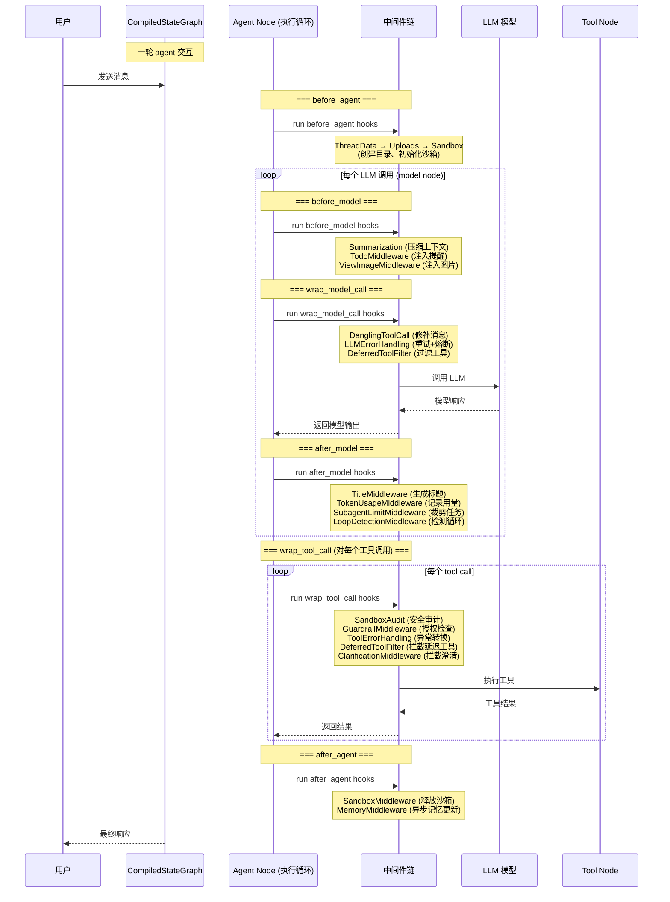

# `_build_middlewares` 深度分析：DeerFlow 中间件加载与编排机制

## 分析方法论

本分析基于以下文件和方法的阅读与追踪：

| 文件 | 阅读目的 |
|------|----------|
| `agents/lead_agent/agent.py` | 核心 `_build_middlewares` 方法及其辅助工厂 |
| `agents/factory.py` | `create_deerflow_agent` 和 `_assemble_from_features` — 另一种构建路径 |
| `agents/middlewares/tool_error_handling_middleware.py` | `build_lead_runtime_middlewares` 和 `_build_runtime_middlewares` 共享基础设施 |
| `agents/middlewares/` 目录下 15 个中间件文件 | 每个中间件的实现、生命周期钩子、职责边界 |
| `sandbox/middleware.py` | Sandbox 生命周期管理中间件 |
| `guardrails/middleware.py` | Guardrail 授权检查中间件 |

**分析方法**：源码走读 + 调用链追踪 + 钩子函数分类。追踪了从 LangGraph Server 触发 `make_lead_agent`，到 `create_agent` 接收 `middleware` 参数，再到 LangChain 框架按 `before_agent → before_model → wrap_model_call → after_model → wrap_tool_call → after_agent` 生命周期调用每个中间件的完整路径。

---

## 一、总体架构概述

DeerFlow 的中间件系统基于 **LangChain AgentMiddleware 协议**构建，提供了 6 个可切入的生命周期钩子点：

| 钩子 | 触发时机 | 用途 |
|------|----------|------|
| `before_agent` | 整个 agent 执行前 | 初始化环境、创建目录 |
| `before_model` | 每次 LLM 调用前 | 预处理消息、注入上下文 |
| `wrap_model_call` | 包裹 LLM 调用 | 过滤/修补消息、重试逻辑 |
| `after_model` | LLM 返回后 | 分析模型输出、检测循环 |
| `wrap_tool_call` | 包裹工具调用 | 拦截/审计/替换工具执行 |
| `after_agent` | 整个 agent 执行后 | 清理资源、异步任务 |

中间件按照严格的顺序构成一条**处理链**，每个中间件可以：
1. 在 `before_*` 阶段修改 state（添加新 key、修改消息列表）
2. 在 `wrap_*` 阶段包裹核心调用（添加重试、注入补丁、拦截特定调用）
3. 在 `after_*` 阶段响应式处理（检测、记录、排队异步任务）

---

## 二、调用链全景

### 2.1 构建阶段



### 2.2 执行阶段 — 一次 agent 交互的生命周期



---

## 三、中间件链：逐一深度解析

### 3.1 ThreadDataMiddleware

**位置**：链最前端（`_build_runtime_middlewares` 的第一个）。

**职责**：创建线程隔离的工作目录结构。

**核心行为**：
- 解析 `thread_id` 和 `user_id`
- 创建 `{base_dir}/users/{user_id}/threads/{thread_id}/user-data/{workspace,uploads,outputs}` 三个目录
- 将路径信息写入 `state.thread_data`（`workspace_path`, `uploads_path`, `outputs_path`）
- 同时给最新 HumanMessage 添加 `run_id` 和 `timestamp` 元数据

**为什么排第一**：后续所有中间件（UploadsMiddleware → 需要知道 uploads 目录在哪里；SandboxMiddleware → 需要 workspace 目录）都依赖 `thread_data` 中的路径信息。必须在这些中间件的 `before_*` 之前就把状态准备好。

**`lazy_init` 设计**：默认 `lazy_init=True` 只计算路径不创建目录，目录在实际使用时才创建。这是性能优化——很多线程甚至不会用到 sandbox 文件操作，跳过不必要的 I/O。

---

### 3.2 UploadsMiddleware

**位置**：`_build_runtime_middlewares` 中通过 `middlewares.insert(1, UploadsMiddleware())` 插入到 ThreadDataMiddleware 之后、SandboxMiddleware 之前。

**职责**：将用户上传的文件信息注入到最近的 HumanMessage 中，让 LLM 知道哪些文件可用。

**核心行为**：
- 在 `before_agent` 中检查最新的 HumanMessage 的 `additional_kwargs.files`
- 区分"新上传文件"和"历史文件"
- 对文档文件提取 outline（标题结构），对无结构的文件提供内容预览
- 在消息内容前插入 `<uploaded_files>...</uploaded_files>` XML 块

**为什么在此位置**：
- 必须在 ThreadDataMiddleware **之后**，因为需要 `thread_data` 中的路径来扫描上传目录
- 必须在 SandboxMiddleware **之前**，因为注入的 `<uploaded_files>` 需要在 LLM prompt 中生效

---

### 3.3 SandboxMiddleware

**位置**：ThreadDataMiddleware 和 UploadsMiddleware 之后。

**职责**：管理 sandbox 生命周期（获取/释放）。

**核心行为**：
- `before_agent`：如果 `lazy_init=False`，立即获取 sandbox 并写入 `state.sandbox.sandbox_id`
- `after_agent`：释放 sandbox 资源
- 默认 `lazy_init=True`，sandbox 在实际执行第一个工具调用时才创建

**为什么在此位置**：Sandbox 是工具执行的容器，即使 `lazy_init=True` 也需要在状态中预留 `sandbox` key。放在 ThreadDataMiddleware 之后确保目录路径已存在，放在 DanglingToolCallMiddleware 之前确保 sandbox 机制在工具执行前就绪。

---

### 3.4 DanglingToolCallMiddleware

**位置**：SandboxMiddleware 之后、LLMErrorHandlingMiddleware 之前。

**职责**：修补消息历史中的"悬挂工具调用"（AIMessage 有 tool_calls 但没有对应的 ToolMessage）。

**核心行为**：
- 使用 `wrap_model_call`（不是 `before_model`），因为它需要**在正确位置**插入补丁消息
- 扫描消息历史，找到那些 tool_call_id 没有对应 ToolMessage 的 AIMessage
- 在被中断的 AIMessage 之后立即插入一个 `status="error"` 的 ToolMessage

**为什么在此位置**：
- 必须在 LLM 调用（LLMErrorHandlingMiddleware）**之前**，确保送入模型的消息历史格式正确
- 使用 `wrap_model_call` 而非 `before_model` 是因为 `before_model` 通过 add_messages reducer 追加消息到列表末尾，而补丁需要插入到指定位置（紧跟在被中断的 AIMessage 后面）
- 必须在所有修改消息的中间件之后（如 UploadsMiddleware 已经改完消息）再执行

---

### 3.5 LLMErrorHandlingMiddleware

**位置**：DanglingToolCallMiddleware 之后、GuardrailMiddleware 之前。

**职责**：处理 LLM 调用错误（重试、熔断、用户友好的错误消息）。

**核心行为**：
- 使用 `wrap_model_call` 包裹 LLM 调用
- 三层错误分类：(1) 可重试（transient, busy）→ 指数退避重试（最多 3 次），(2) 不可重试（quota, auth）→ 立即返回错误消息，(3) 熔断器——连续失败超过阈值后直接快速失败
- 对 LangGraph 控制流信号（`GraphBubbleUp`）做 pass-through

**为什么在此位置**：
- 最外层的 LLM 调用包裹——所有其他 `wrap_model_call` 修饰符都在它之后执行，这样即使其他中间件出错，也能被 LLMErrorHandling 兜底
- 熔断器状态会影响所有后续的 LLM 调用

---

### 3.6 GuardrailMiddleware（可选）

**位置**：LLMErrorHandlingMiddleware 之后、SandboxAuditMiddleware 之前。

**职责**：对工具调用进行授权检查，拒绝不合规的操作。

**核心行为**：
- 使用 `wrap_tool_call` 拦截每个即将执行的工具调用
- 通过 pluggable `GuardrailProvider` 协议评估工具调用
- 拒绝时返回 `status="error"` 的 ToolMessage，允许 agent 继续运行
- 支持 `fail_closed`（默认拒绝）和 `fail_open`（默认放行）模式
- 提供内置 `AllowlistProvider` 和 OAP 策略提供者选项

**可选条件**：`app_config.guardrails.enabled and app_config.guardrails.provider`

**为什么在此位置**：在工具实际执行前做安全检查，但要在 LLM 调用成功之后。在 SandboxAuditMiddleware 之前，因为 sandbox 审计更偏日志记录，而 guardrail 是真正的授权决策。

---

### 3.7 SandboxAuditMiddleware

**位置**：GuardrailMiddleware 之后、ToolErrorHandlingMiddleware 之前。

**职责**：bash 命令安全审计——对高风险命令进行阻止/警告。

**核心行为**：
- 使用 `wrap_tool_call` **仅拦截** `name == "bash"` 的工具调用
- 三层风险分级：high-risk（block）→ 返回错误 ToolMessage；medium-risk（warn）→ 执行但附加警告；safe（pass）→ 正常执行
- 高风险模式覆盖了 15 种攻击向量（如 `rm -rf /`、`curl|bash`、fork bombs、LD_PRELOAD 劫持等）
- 输出结构化日志记录

**为什么在此位置**：
- 在 ToolErrorHandlingMiddleware 之前，因为安全的 audit rejection 不应被视作"工具执行错误"
- 在 GuardrailMiddleware 之后，但负责不同维度：guardrail 是**策略授权**（是否可以调用），audit 是**命令级别**（这个命令是否危险）

---

### 3.8 ToolErrorHandlingMiddleware

**位置**：SandboxAuditMiddleware 之后、所有 lead-only 中间件之前。

**职责**：捕获工具执行中的异常，转换为用户友好的 ToolMessage。

**核心行为**：
- 使用 `wrap_tool_call` 包裹所有工具调用
- `try/except` 捕获异常，构建结构化的错误 ToolMessage（含工具名、错误类型、截断的详细信息）
- 对 `GraphBubbleUp`（LangGraph 控制流信号）做 pass-through

**为什么在此位置**：
- "安全网"位置——在所有工具执行相关的中间件（Guardrail, SandboxAudit, Sandbox）之后
- 确保无论哪个中间件或底层工具抛出异常，都不会导致整个 agent 崩溃
- 是所有 `wrap_tool_call` 链的最内层（最靠近实际执行）

---

### 3.9 SummarizationMiddleware（可选）

**位置**：ToolErrorHandlingMiddleware 之后、TodoMiddleware 之前。

**职责**：在上下文长度接近限制时自动压缩对话历史。

**核心行为**：
- 扩展 LangChain 内置 `SummarizationMiddleware`
- 通过 `before_model` 检查当前消息的 token 计数
- 达到触发条件后，对早期消息进行 LLM 摘要（使用独立模型）
- **技能文件保护**：检测最近加载的 skill 文件内容（`read_file` 调用），将它们从被摘要的范围内"营救"出来
- 保留摘要后的 `HumanMessage(name="summary")`——前端不显示但模型可见

**可选条件**：`config.summarization.enabled == true`

**为什么在此位置**：
- 摘要压缩上下文后，后续中间件处理的是精简后的消息列表
- 早于 TodoMiddleware 和 TitleMiddleware，这样摘要后的消息也不会丢失 todo 状态
- `before_model` 阶段执行，因为压缩需要在 LLM 调用前完成

---

### 3.10 TodoMiddleware（可选）

**位置**：SummarizationMiddleware 之后、TokenUsageMiddleware 之前。

**职责**：任务列表管理 + 上下文丢失检测 + 防止提前退出。

**核心行为**：
- 扩展 LangChain `TodoListMiddleware`
- `before_model`：检测 `write_todos` 工具调用是否已被摘要出上下文窗口，如果是则注入 `todo_reminder` HumanMessage
- `after_model`：检测 agent 是否在还有未完成任务的情况下尝试退出，如果是则通过 `jump_to` 跳回模型节点继续执行
- 设有 `_MAX_COMPLETION_REMINDERS = 2` 防止无限循环

**可选条件**：`config.configurable.is_plan_mode == True`

**为什么在此位置**：
- 在 SummarizationMiddleware 之后，因为摘要可能清除了 `write_todos` 调用记录——此时 TodoMiddleware 的上下文丢失检测正好补位
- 在 TokenUsageMiddleware、TitleMiddleware、MemoryMiddleware 之前，因为它可能通过 `jump_to` 改变执行流（跳回模型），这些中间件的副作用不应在跳转前执行

---

### 3.11 TokenUsageMiddleware（可选）

**位置**：TodoMiddleware 之后、TitleMiddleware 之前。

**职责**：记录 token 使用量并构建 step attribution（步骤归因）元数据。

**核心行为**：
- `after_model` 检查 AIMessage 的 `usage_metadata`
- 构建详细的 step attribution 信息（`_build_attribution`）：
  - 区分 todo 操作、subagent 调度、搜索查询、文件展示、澄清请求
  - 对 `write_todos` 做前后对比 diff，精确标记每项任务的增删改
- 将 attribution 写入 `additional_kwargs["token_usage_attribution"]`

**可选条件**：`app_config.token_usage.enabled == true`

**为什么在此位置**：
- 在 TitleMiddleware 之前，这样标题生成不会被中间件的副作用影响
- `after_model` 执行，确保拿到的是模型完整的响应

---

### 3.12 TitleMiddleware

**位置**：TokenUsageMiddleware 之后、MemoryMiddleware 之前。

**职责**：在第一次完整的用户-助手交换后自动生成线程标题。

**核心行为**：
- `after_model` 检测是否满足生成标题的条件（标题不存在且恰有一轮人机对话）
- 使用独立的 LLM 调用生成标题（继承父 RunnableConfig 并添加 `middleware:title` tag 以便 RunJournal 识别）
- LLM 调用失败时降级为本地 fallback（取用户消息的前 50 字符）
- 去除 reasoning 模型的 `<think>` 标签

**为什么在此位置**：
- 在 MemoryMiddleware 之前，这样标题出现在记忆中被持久化
- 在所有工具执行完成、模型最终输出之后执行

---

### 3.13 MemoryMiddleware

**位置**：TitleMiddleware 之后、ViewImageMiddleware 之前。

**职责**：将对话加入异步记忆更新队列。

**核心行为**：
- `after_agent` 阶段（整个 agent 执行完成后）触发
- 过滤消息（只保留用户输入和最终助手响应，丢弃工具调用中间消息）
- 执行 `filter_messages_for_memory` 提取人类消息和 AI 消息
- 检测 correction（用户纠正）和 reinforcement（用户强化）信号
- 捕获 `user_id`（在请求上下文中有效时）并显式传递给队列（因为 `threading.Timer` 无法传播 ContextVar）
- 通过 `get_memory_queue().add()` 将过滤后的消息放入 debounced 异步队列

**为什么在此位置**：
- 在 TitleMiddleware 之后，确保标题已生成
- 在 ViewImageMiddleware 之前——不重要，但保持逻辑分组
- `after_agent` 阶段执行，确保获得完整的交互数据

---

### 3.14 ViewImageMiddleware（可选）

**位置**：MemoryMiddleware 之后、DeferredToolFilterMiddleware 之前。

**职责**：在 view_image 工具调用完成后，将图片的 base64 数据注入消息历史供 LLM 分析。

**核心行为**：
- `before_model` 检测上一个 AIMessage 是否包含 `view_image` 工具调用以及是否全部完成
- 从 `state.viewed_images` 中提取 base64 数据
- 注入一个包含图片信息的 HumanMessage（文本描述 + image_url base64 块）
- 使用去重保护防止重复注入

**可选条件**：model_config 配置了 `supports_vision == true`

**为什么在此位置**：
- `before_model` 阶段执行，确保 LLM 在下次调用前能看到图片
- 在 SummarizationMiddleware 之后——Summarization 可能会移除早期的 tool 调用记录，但不会影响刚完成的 view_image 结果

---

### 3.15 DeferredToolFilterMiddleware（可选）

**位置**：ViewImageMiddleware 之后、SubagentLimitMiddleware 之前。

**职责**：将"延迟注册"的 MCP 工具从 LLM 看到的 tool schema 中移除，但保留在 ToolNode 中用于执行路由。

**核心行为**：
- **双重拦截**：
  - `wrap_model_call`：从 `request.tools` 中过滤掉延迟注册的工具，不让 LLM 看到它们
  - `wrap_tool_call`：如果 LLM 仍然调用了延迟工具（通过其他途径发现），返回错误 ToolMessage 指导使用 `tool_search`
- 延迟工具通过 `tool_search` 在运行时被发现和激活

**可选条件**：`app_config.tool_search.enabled == true`

**为什么在此位置**：
- `wrap_model_call` 在最外层过滤 tool schema，而 LLMErrorHandlingMiddleware 的 `wrap_model_call` 更外层——但 DeferredToolFilter 必须在内层（检测到 LLM 非法调用延迟工具时需要转化为 ToolMessage），所以它先于 SubagentLimitMiddleware
- 过滤必须在 LLM 看到 tool schema 之前

---

### 3.16 SubagentLimitMiddleware（可选）

**位置**：DeferredToolFilterMiddleware 之后、LoopDetectionMiddleware 之前。

**职责**：限制单次模型响应中的并行 subagent `task` 工具调用数量。

**核心行为**：
- `after_model` 检测 AIMessage 中的 `task` 工具调用数量
- 如果超过 `max_concurrent`（默认 3，范围 [2, 4]），只保留前 N 个，丢弃多余的
- 通过替换 AIMessage 的 `tool_calls` 列表（相同 id 触发 LangGraph 替换）

**可选条件**：`config.configurable.subagent_enabled == True`

**为什么在此位置**：
- 在 LoopDetectionMiddleware 之前，因为裁剪后的工具调用列表减少了循环检测的噪声
- `after_model` 阶段执行，只有拿到模型完整输出后才能判断

---

### 3.17 LoopDetectionMiddleware

**位置**：SubagentLimitMiddleware 之后、ClarificationMiddleware 之前。

**职责**：检测并打破重复的工具调用循环。

**核心行为**：
- `after_model` 执行两层检测：
  1. **哈希层**：计算工具调用集合的确定性哈希（顺序无关），跟踪滑动窗口中出现次数
     - `>= 3` 次：注入循环警告消息
     - `>= 5` 次：强制执行硬停止——清除所有 tool_calls 和原始 provider 元数据，强制模型输出文本
  2. **频率层**：追踪同一工具类型的总调用次数（跨不同参数）
     - `>= 30` 次：注入频率警告
     - `>= 50` 次：强制执行硬停止
- 对 `read_file` 有特殊的范围补丁逻辑（分桶模式，避免连续读取不同行被误判为循环）
- 对 `write_file`/`str_replace` 使用全参数哈希（避免不同内容被错误合并）
- 使用 `OrderedDict` 实现 LRU 淘汰跟踪（最多 100 个线程）

**为什么在此位置**：
- 在所有可能修改 tool_calls 的中间件（SubagentLimitMiddleware）之后，防止误判
- 在 ClarificationMiddleware 之前，保证循环检测不会覆盖澄清打断

---

### 3.18 ClarificationMiddleware

**位置**：链的最末端（始终最后一个）。

**职责**：拦截模型的 `ask_clarification` 工具调用并中断执行流，将澄清问题呈现给用户。

**核心行为**：
- `wrap_tool_call` 拦截 `name == "ask_clarification"` 的工具调用
- 构建格式化的澄清消息（根据类型选择 emoji、格式化选项列表）
- 返回 `Command(goto=END, update={messages: [ToolMessage]})`：将问题作为 ToolMessage 加入消息历史，然后中断执行流

**为什么绝对最后一个**：
- 这是**唯一**会通过 `Command(goto=END)` 中断整体执行流的中间件
- 如果在它之后的中间件修改了 state 或消息，这些修改在 goto=END 后不会再被处理
- 所有其他中间件都需要在它之前完成自己的 `after_model` / `wrap_tool_call` 处理
- 源代码第 303-307 行明确注明了这一点，且在 `factory.py` 的 `_insert_extra` 后有强制保证：`clar_idx == len(chain) - 1`

---

## 四、条件加载策略

| 中间件 | 条件 | 控制源 |
|--------|------|--------|
| SummarizationMiddleware | `config.summarization.enabled` | `config.yaml` |
| TodoMiddleware | `config.configurable.is_plan_mode` | 运行时请求参数 |
| TokenUsageMiddleware | `config.token_usage.enabled` | `config.yaml` |
| GuardrailMiddleware | `config.guardrails.enabled and provider` | `config.yaml` |
| ViewImageMiddleware | 模型 `supports_vision` | 模型配置 |
| DeferredToolFilterMiddleware | `config.tool_search.enabled` | `config.yaml` |
| SubagentLimitMiddleware | `config.configurable.subagent_enabled` | 运行时请求参数 |

**强制加载的中间件**（始终在链中）：
- ThreadDataMiddleware
- UploadsMiddleware
- SandboxMiddleware
- DanglingToolCallMiddleware
- LLMErrorHandlingMiddleware
- SandboxAuditMiddleware
- ToolErrorHandlingMiddleware
- TitleMiddleware
- MemoryMiddleware
- LoopDetectionMiddleware
- ClarificationMiddleware

**定制注入点**：`_build_middlewares` 的 `custom_middlewares` 参数允许在 ClarificationMiddleware 之前插入自定义中间件，用于扩展场景：

```python
# 调用方示例
_build_middlewares(
    config=config,
    model_name=model_name,
    agent_name=agent_name,
    custom_middlewares=[MyCustomMiddleware()],
    app_config=app_config,
)
```

---

## 五、LangChain 中间件协议集成

DeerFlow 的中间件系统充分利用了 LangChain 的 `AgentMiddleware` 抽象类：

```
AgentMiddleware[StateT]
│
├── before_model(state, runtime) → dict | None     # LLM 调用前
├── abefore_model(state, runtime) → dict | None     # (async)
├── after_model(state, runtime) → dict | None      # LLM 调用后
├── aafter_model(state, runtime) → dict | None      # (async)
├── before_agent(state, runtime) → dict | None      # Agent 执行前
├── abefore_agent(state, runtime) → dict | None     # (async)
├── after_agent(state, runtime) → dict | None       # Agent 执行后
├── aafter_agent(state, runtime) → dict | None      # (async)
├── wrap_model_call(request, handler) → response    # 包裹 LLM 调用
├── awrap_model_call(request, handler) → response   # (async)
├── wrap_tool_call(request, handler) → response     # 包裹工具调用
└── awrap_tool_call(request, handler) → response    # (async)
```

**DeerFlow 对协议的使用模式**：

1. **同步实现为主**——绝大多数中间件只实现了同步版本（因为没有真正的 I/O 阻塞），`async` 版本通过委派给同步版本实现：

```python
# 典型模式
@override
def after_model(self, state, runtime):
    return self._apply(state)

@override
async def aafter_model(self, state, runtime):
    return self._apply(state)
```

2. **`state` 的响应式更新**——所有 `before_*` / `after_*` 返回 `dict | None`，返回的 dict 通过 LangGraph 的 add_messages reducer 合并到 state 中。这保证了：
   - 多个中间件可以独立更新 state 的不同 key
   - 消息更新通过 LangGraph 的 `add_messages` 管理（按 id 去重）
   - 返回 `None` 表示"不需要更新"

3. **`wrap_*` 协议的嵌套**——`wrap_model_call` 和 `wrap_tool_call` 形成调用栈：
   - 外层中间件可以过滤输入、重试、或完全替换内部行为
   - 内层中间件处理更具体的逻辑

4. **`ToolCallRequest.runtime`**——LangGraph v2 提供的 `ToolRuntime` 上下文让中间件可以访问 `thread_id` 和 `run_id` 而不依赖全局状态

---

## 六、Shared Runtime vs Lead-only 的构建策略

代码库中存在两条构建路径：

### 6.1 `_build_runtime_middlewares()`（共享基础）

由 `build_lead_runtime_middlewares()` 和 `build_subagent_runtime_middlewares()` 共用：

```python
def _build_runtime_middlewares(*, app_config, include_uploads, include_dangling_tool_call_patch, lazy_init):
    middlewares = [
        ThreadDataMiddleware(lazy_init=lazy_init),
        SandboxMiddleware(lazy_init=lazy_init),
    ]
    if include_uploads:         # lead agent: True; subagent: False
        middlewares.insert(1, UploadsMiddleware())
    if include_dangling_tool_call_patch:  # both: True
        middlewares.append(DanglingToolCallMiddleware())
    middlewares.append(LLMErrorHandlingMiddleware(app_config=app_config))
    # GuardrailMiddleware (可选)
    middlewares.append(SandboxAuditMiddleware())
    middlewares.append(ToolErrorHandlingMiddleware())
    return middlewares
```

**设计意图**：subagent 不需要 UploadsMiddleware（subagent 不直接处理文件上传），但需要 ThreadData、Sandbox、DanglingToolCall 修补、错误处理和安全审计。

### 6.2 `_build_middlewares()`（lead agent 专属）

在共享基础之上附加 9 个 lead-only 中间件（摘要、TODO、token 统计、标题、记忆、图片、subagent 限制、循环检测、澄清）。

### 6.3 `_assemble_from_features()`（SDK 替代路径）

`factory.py` 的 `create_deerflow_agent` 提供了另一种构建方式——通过 `RuntimeFeatures` 声明式选择功能。中间件顺序与 `_build_middlewares` 一致，但额外支持：
- `@Next`/`@Prev` 锚定：自定义中间件可以声明插入到内置中间件的**前面**或**后面**
- 自动去重：工具去重（用户提供的工具优先于 feature 注入的工具）
- 不变量保证：`ClarificationMiddleware` 必须在链末端的检查

---

## 七、架构见解与设计决策

### 7.1 关键决策

1. **分层构建（Runtime + Lead）**：将 ThreadData → ToolErrorHandling 这一共享"内核"抽离为 `_build_runtime_middlewares`，同时服务于 lead agent 和 subagent。减少了代码重复，保证了一致的错误处理和安全策略。

2. **`lazy_init` 性能优化**：ThreadDataMiddleware 和 SandboxMiddleware 默认不创建目录/资源，推迟到实际使用时。这对只聊天不用工具的交互是重要的优化。

3. **消息修补 vs 状态注入**：DanglingToolCallMiddleware 使用 `wrap_model_call`（而非 `before_model`）解决消息插入位置问题——这是对 LangGraph `add_messages` reducer 追加语义的巧妙规避。

4. **`wrap_tool_call` 的分层拦截**：ClarificationMiddleware（goto=END 打断）在最外层，SandboxAudit（安全检查）在中间，ToolErrorHandling（异常兜底）在最内层。外层拦截"要不要执行"决策，内层处理"执行后的异常"。

5. **ClarificationMiddleware 的"绝对最后"不变量**：这是系统中最关键的顺序约束——代码通过显式检查和 `factory.py` 的强制移动来保证。

### 7.2 设计模式

| 模式 | 示例 |
|------|------|
| **责任链** | 18 个中间件串联成一条处理链 |
| **装饰器** | `wrap_model_call` / `wrap_tool_call` 形成嵌套装饰器栈 |
| **策略模式** | GuardrailMiddleware 通过 pluggable `GuardrailProvider` 实现不同的授权策略 |
| **模板方法** | LangChain `AgentMiddleware` 定义了钩子调用顺序的模板 |
| **观察者** | SummarizationMiddleware 的 `BeforeSummarizationHook` 允许外部注册回调 |
| **熔断器** | LLMErrorHandlingMiddleware 内置了 Provider 级熔断器 |

### 7.3 扩展点

- **`custom_middlewares` 参数**：在 ClarificationMiddleware 之前注入自定义中间件
- **`extra_middleware` 参数**（SDK 路径）：支持 `@Next`/`@Prev` 精确定位
- **`RuntimeFeatures`**：声明式功能开关，自动组装对应的中间件
- **`BeforeSummarizationHook`**：摘要前的可插拔钩子
- **`GuardrailProvider`**：可替换的授权策略提供者

### 7.4 潜在的改进方向

1. `after_agent` 的执行语义在 LangGraph v2 中可能因 `goto=END` 短路，SandboxMiddleware 的 sandbox 释放依赖于 `after_agent`，若 ClarificationMiddleware 先触发 goto=END，sandbox 可能没有及时释放
2. 条件中间件列表构建使用 `if` + `append` 模式而非声明式配置，手工确保顺序的一致性需要开发者对整条链有全局理解
3. 跨线程的 `_lock` 管理（LoopDetectionMiddleware 和 LLMErrorHandlingMiddleware 使用 `threading.Lock`）意味着这些中间件实例是全局共享的，在多 worker 场景下可能成为瓶颈

---

*分析完成于 2026-05-30。代码版本基于 DeerFlow main 分支最新提交。*
